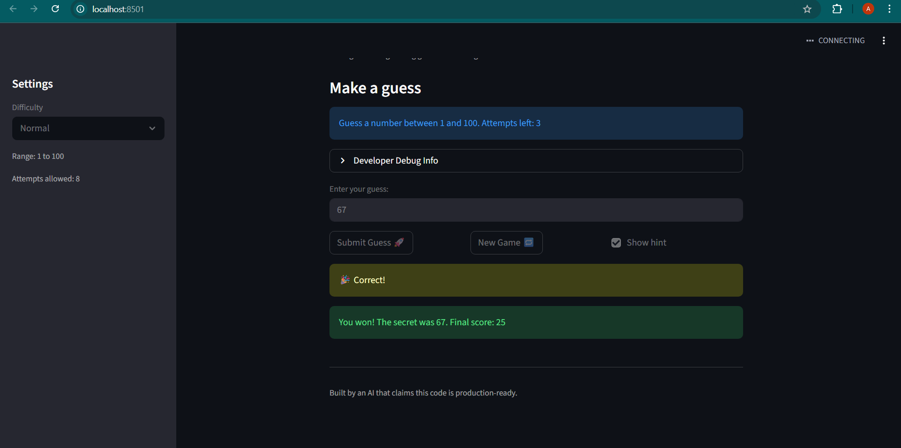

# 🎮 Game Glitch Investigator: The Impossible Guesser

## 🚨 The Situation

You asked an AI to build a simple "Number Guessing Game" using Streamlit.
It wrote the code, ran away, and now the game is unplayable.

- You can't win.
- The hints lie to you.
- The new game button does nothing.

## 🛠️ Setup

1. Create a virtual environment: `python -m venv venv`
2. Activate it:
   - Windows: `venv\Scripts\activate`
   - Mac/Linux: `source venv/bin/activate`
3. Install dependencies: `pip install -r requirements.txt`
4. Run the app: `python -m streamlit run app.py`

## 🕵️‍♂️ Your Mission

1. **Play the game.** Open the "Developer Debug Info" tab to see the secret number. Try to win.
2. **Find the Bugs.** Observe what breaks — hints, scoring, buttons, state.
3. **Fix the Logic.** Move core logic into `logic_utils.py` and repair the bugs.
4. **Refactor & Test.** Run `pytest tests/ -v` and keep fixing until all tests pass!

## 📝 Document Your Experience

**Game Purpose:**
A number guessing game built with Streamlit where the player tries to guess
a secret number within a limited number of attempts. The game provides
hints after each guess to guide the player toward the answer.

**Bugs Found:**
1. **Hints were lying** — On even attempts, the secret number was converted
   to a string, causing Python string comparison instead of integer comparison.
   This made hints point the player in the wrong direction.
2. **New Game button was broken** — Clicking New Game reset the secret and
   attempts but never reset the game `status`. So a finished game would
   immediately hit `st.stop()` and block the new game from starting.
3. **Duplicate guesses not handled** — Submitting the same number twice gave
   no warning and inconsistently tracked attempts.

**Fixes Applied:**
1. Moved `check_guess` into `logic_utils.py` and removed the string
   conversion bug. Fixed hint messages to correctly say Go LOWER/Go HIGHER.
2. Updated the New Game button to reset `status`, `score`, and `history`
   in addition to `attempts` and `secret`.
3. Added `conftest.py` to fix pytest module resolution and updated all
   tests to correctly unpack the tuple returned by `check_guess`.

## 📸 Demo



> The game now correctly guides the player with accurate hints and fully
> resets between games.

## 🧪 Tests

All 6 pytest cases pass:
```
tests/test_game_logic.py::test_winning_guess          PASSED
tests/test_game_logic.py::test_guess_too_high         PASSED
tests/test_game_logic.py::test_guess_too_low          PASSED
tests/test_game_logic.py::test_hint_message_too_high  PASSED
tests/test_game_logic.py::test_hint_message_too_low   PASSED
tests/test_game_logic.py::test_no_string_conversion   PASSED
```
